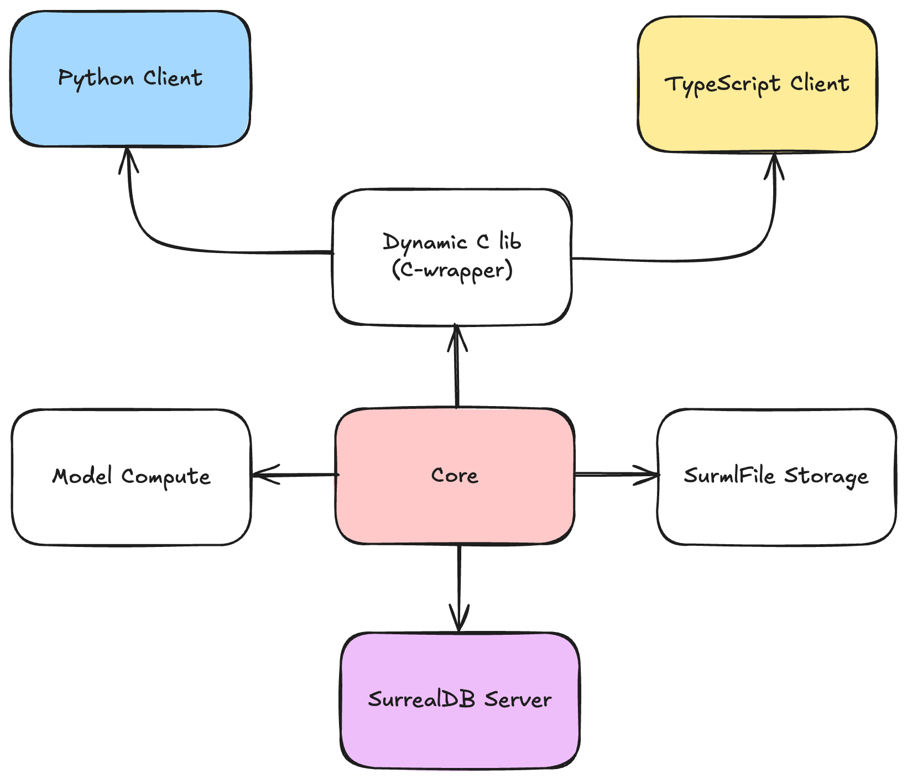

# SurrealMl

This package is for storing machine learning models with meta data in Rust so they can be used on the SurrealDB server.

## What is SurrealML?

SurrealML is a feature that allows you to store trained machine learning models in a special format called 'surml'. This enables you to run these models in either Python or Rust, and even upload them to a SurrealDB node to run the models on the server

## Structure

The SurrealML structure takes the following outline:

<p align="center">
  
</p>

We can see that the `core` module is the Rust module that houses the ML model file storage and execution of models. This `core` module is directly compiled into the surrealDB server to load, save, and run ML models. A `c-wrapper` rust workspace imports the `core` and produces a dynamic C lib that clients like `TypeScript` and `Python` can link to and run. This means that the exact same code that runs in the SurrealDB server runs in the clients. The install scripts for clients essentially download the precompiled dynamic C libs from `releases` in the repo and link to them.


## Prerequisites

1. A basic understanding of Machine Learning: You should be familiar with ML concepts, algorithms, and model training processes.
2. Knowledge of Python: Proficiency in Python is necessary as SurrealML involves working with Python-based ML models.
3. Familiarity with SurrealDB: Basic knowledge of how SurrealDB operates is required since SurrealML integrates directly with it.
4. Python Environment Setup: A Python environment with necessary libraries installed, including SurrealML, PyTorch or SKLearn (depending on your model preference).
5. SurrealDB Installation: Ensure you have SurrealDB installed and running on your machine or server

## New Clients

We have removed `PyO3` for a raw dynamic C lib written in rust. This is how working with Python and we can also link this dynamic C lib to other languages such as JavaScript. The new `Python` client is housed in the `clients`
directory. Please visit this for the updated installation and API docs.


# Running CI locally

Running CI locally can be done with the following command:

```bash
cargo make --no-workspace preflight
```

This runs a series of tests in docker containers for dynamic C lib loading and `core` tests for `sklearn`, `tensorflow`, and `pytorch`.
